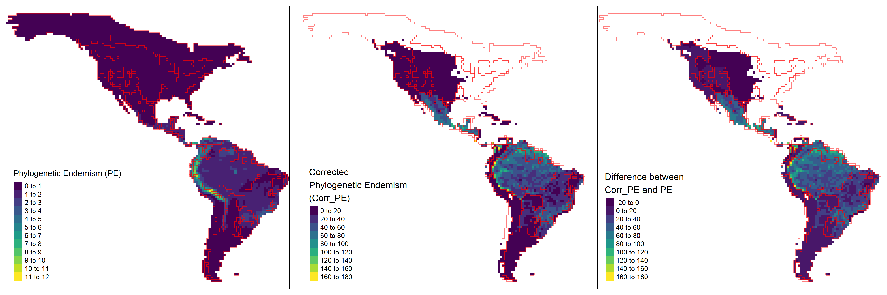

```{r setup, include=FALSE}
options(htmltools.dir.version = FALSE)
knitr::opts_chunk$set(collapse = TRUE,
                      fig.retina = 3)

library(ymlthis)
library(tidyverse)
```

layout: true

---

class: title-slide, center, bottom

# `r rmarkdown::metadata$title`

## `r rmarkdown::metadata$subtitle`

### `r rmarkdown::metadata$author`

---
name: clouds
class: center, middle
background-image: url(images/Clouds.jpg)
background-size: cover

```{r meta, echo=FALSE}
library(metathis)
meta() %>%
  meta_general(
    description = "Invited lecture in Biogeography class at TAMUCC",
    generator = "xaringan and remark.js"
  ) %>% 
  meta_name("github-repo" = "GabrielNakamura/lecture_Biogeography_tamucc") %>% 
  meta_social(
    title = "Bridging the gap among community phylogenetics, biogeography and macroevolution",
    url = "",
    image = "",
    image_alt = "The first slide features...",
    og_type = "website",
    twitter_card_type = "summary_large_image"
  )
```

???
Thank you everyone for the presence.

---
template: clouds

## Photograph albums

???

Photographs are a interesting thing since we can get some information based only on a very tiny time-slice

---

name: clouds
class: center, middle
background-image: url(images/Clouds.jpg)
background-size: cover

## For example..

--

```{r echo=FALSE, out.width="38%", fig.alt= "A image of a photo frame with a photo of a..."}
 knitr::include_graphics("images/photo_frame.png")
```

???
For example, take a look of this picture, what we can conclude from this scene is very straightforward

---

name: clouds
class: center, midle
background-image: url(images/Clouds.jpg)
background-size: cover

## Not everything is what it seems...

```{r echo=FALSE, out.width="38%", fig.alt= "A image of a photo frame with a photo with a revelation..."}
 knitr::include_graphics("images/photo_frame.png")
```

???
Not everything is what seems by just looking at a small piece of time-slice, sometimes, to understand 
the what lead to a given situation we need to go back to the past to understand the current events we are facing

---

name: clouds
class: center, midle
background-image: url(images/Clouds.jpg)
background-size: cover

## Looking at the past to understand the present....


```{r echo=FALSE, out.width="50%", fig.alt= "A black and white family album."}
 knitr::include_graphics("images/photo-album.jpeg")
```


???
Sometimes, to understand the present we need to revisit the past, it is not enough to look at only current photographs. Like a family album, when we look at past photos we can better understand the context of the most recent photographs


---

## Understanding the history of life on Earth

.pull-left[

```{r echo=FALSE, out.width="100%", fig.alt= "A painting illustrating some representants of Cambrian period"}
 knitr::include_graphics("images/burgess-shale.jpeg")
```

]

--

.pull-right[

```{r echo=FALSE, out.width="100%", fig.alt= "A painting illustrating some invertebrate marine species found currently"}
 knitr::include_graphics("images/marine_invertebrate.jpg")
```

]

???
The same rationale can be extended to understand the distribution of life on earth, when we are trying to explain 
the factors influencing biodiversity patterns we currently saw we can not just rely on current factors, like current 
climate conditions. Why?

---

## Historical events matters

.pull-left[
- Historical dispersal

- Speciation events (in-situ speciation)

- Evolutionary Events
]

.pull-right[

```{r echo=FALSE, out.width="60%", fig.alt= "A painting illustrating past dispersal routes for human population" }
knitr::include_graphics("images/dispersal_homo.jpeg")
```

```{r echo=FALSE, out.width="60%", fig.alt= "A painting illustrating Darwin's finches" }
knitr::include_graphics("images/in_situ_events.jpeg")
```

.footnote[[Image credits here](https://github.com/GabrielNakamura/DivB_metrics)]
]

???
For example, we cannot explain the patterns of human-occupation if we do not consider the dispersal routes made by 
ancestral populations

---

### Search for the factors that generate these patterns

???
And complementary I use try to find which factors explain these patterns, focused mainly on processes related to the evolution of organisms like speciation and historical dispersal.


---
template: clouds2
class: middle, center
background-image: url(images/Clouds.jpg)
background-size: cover

## What influence the distribution of biological diversity on earth?

???
As I said, capture effectively biodiversity patterns is just one 
step towards the understanding of the causes of biodiversity distribution on earth

--

### From patterns to process: searching for the causes

???
To fully answer this question we need to explain biodiversity patterns by searching for what generates it

--

#### How historical factors affect the current distribition of biological diversity?

???
And in the last year this is what I'm trying to do, specifically I'm interested in understand how processes associated with speciation and historical dispersal are responsible to generate the current patterns of
distribution in biological diversity

---

## Some real-world examples

.pull-left[
```{r echo=FALSE, out.width="90%", fig.alt= "Map showing America continents with colors indicating values of phylogenetic endemism in a gradient of blue"}
 
```
```{r echo=FALSE, out.width="90%", fig.alt= "Map showing America continents with colors indicating values of arrival"}
knitr::include_graphics("images/Jetz_age_arrival.png")
```
.footnote[GitHub repo [here](https://github.com/GabrielNakamura/DivB_metrics)]

]

???
To do so Now I'm developing numerical methods in historical biogeography that disentangle the importance of in situ speciation
and historical dispersal to generate spatial patterns in Phylogenetic diversity of assemblages

--

.center2[
- Development of .green[Model-based] Phylogenetic metrics

- Unification Macroecology, Macroevolution and Community Ecology
]

???

Briefly I started to adapt common metrics used in community ecology, like PD and PE, and merge this metrics with macroevolutionary models, like ancestral area reconstruction, to be able to capture historical process.

For those who want to see more about the technical details, you can access github codes for this project and the package that Im calling, just for now, as Rrodotus.

---
template: clouds
class: top, left

.pull-left[
# .big-text[Thank you for your attention!]
]

???


--

.pull-right[


  
  [`r icon::fa("github")` @GabrielNakamura](https://github.com/GabrielNakamura)  
  
  [`r icon::fa("door-open")` Personal website](https://gabrielnakamura.netlify.app/)
  
  [`r icon::fa("twitter")` @gabrielnakamur4](https://twitter.com/gabrielnakamur4)
  

]

???

For those who become interested in my work you can find a little bit more in my website and github account, and of course catch me up here at A&M

