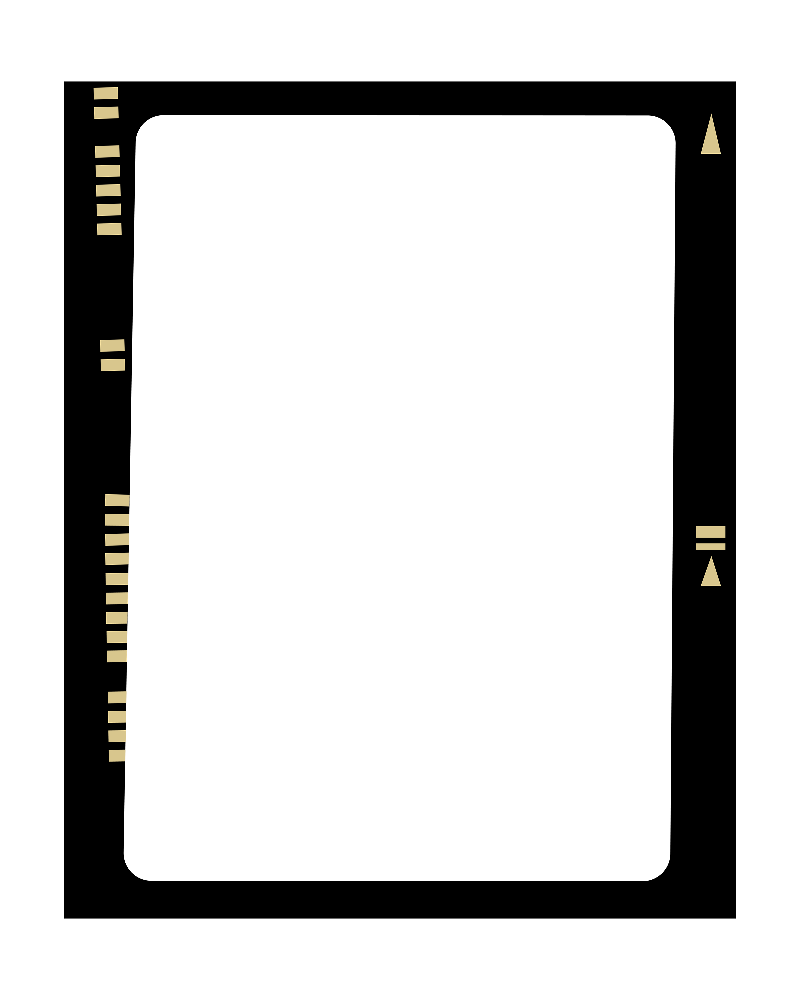
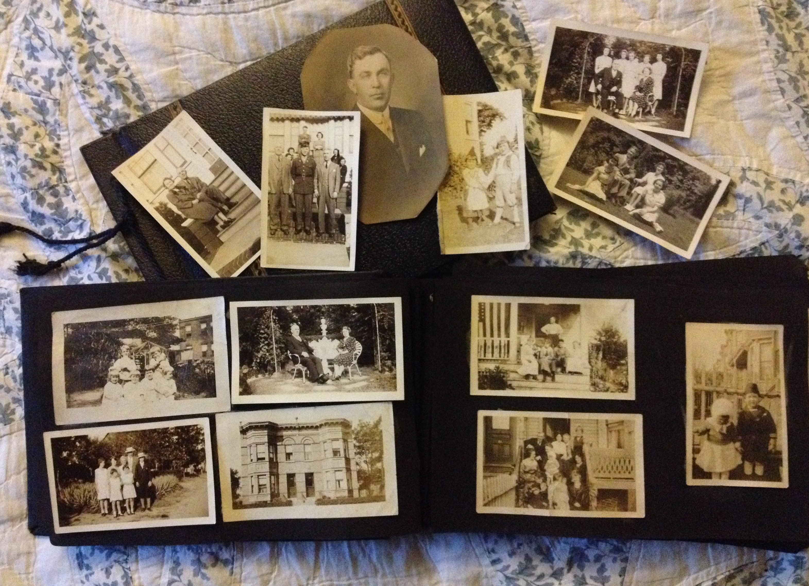
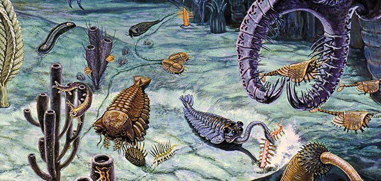
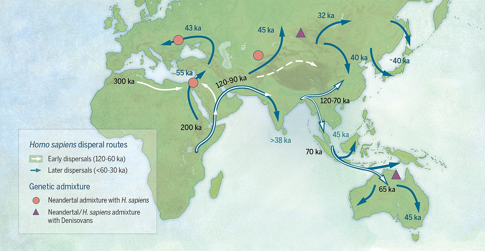
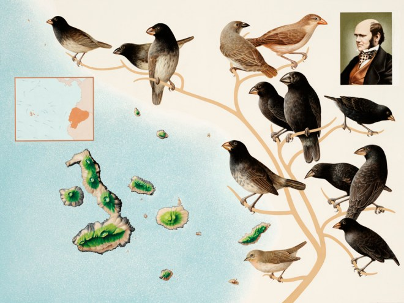
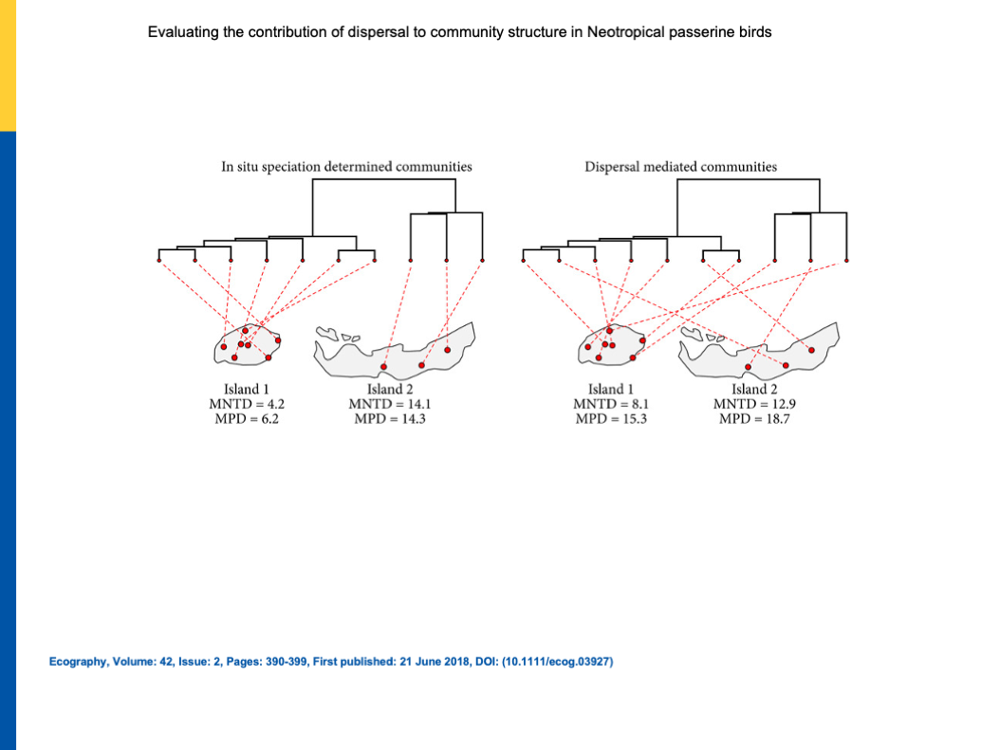
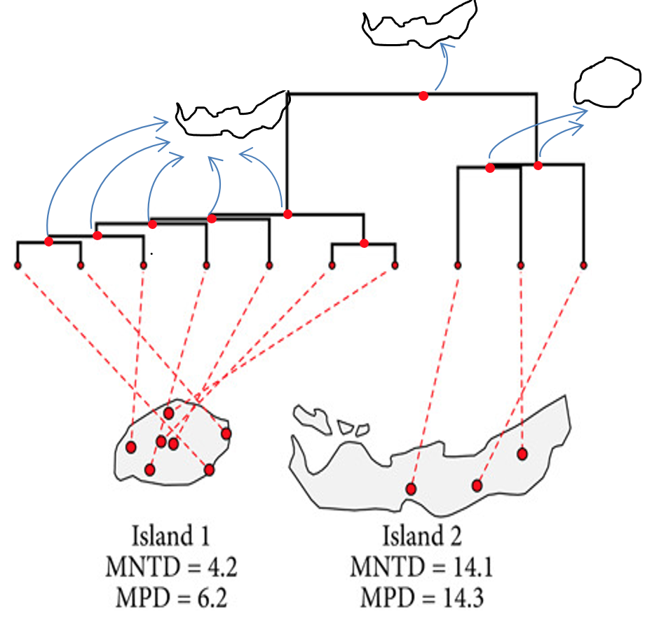

```{r setup, include=FALSE}
options(htmltools.dir.version = FALSE)
knitr::opts_chunk$set(collapse = TRUE,
                      fig.retina = 3)

library(ymlthis)
library(tidyverse)
```

layout: true

---

class: title-slide, center, bottom

# `r rmarkdown::metadata$title`

## `r rmarkdown::metadata$subtitle`

### `r rmarkdown::metadata$author`

---
name: clouds
class: center, middle
background-image: url(images/Clouds.jpg)
background-size: cover

```{r meta, echo=FALSE}
library(metathis)
meta() %>%
  meta_general(
    description = "Invited lecture in Biogeography class at TAMUCC",
    generator = "xaringan and remark.js"
  ) %>% 
  meta_name("github-repo" = "GabrielNakamura/lecture_Biogeography_tamucc") %>% 
  meta_social(
    title = "Bridging the gap among community phylogenetics, biogeography and macroevolution",
    url = "",
    image = "",
    image_alt = "The first slide features...",
    og_type = "website",
    twitter_card_type = "summary_large_image"
  )
```

???
Thank you everyone for the presence.

---
template: clouds

## Photograph albums

???

Photographs are a interesting thing since we can get some information based only on a very tiny time-slice

---

name: clouds
class: center, middle
background-image: url(images/Clouds.jpg)
background-size: cover

## For example..

--

```{r echo=FALSE, out.width="38%", fig.alt= "A image of a photo frame with a photo of a..."}
 
```

???
For example, take a look of this picture, what we can conclude from this scene is very straightforward

---

name: clouds
class: center, midle
background-image: url(images/Clouds.jpg)
background-size: cover

## Not everything is what it seems to be...

```{r echo=FALSE, out.width="38%", fig.alt= "A image of a photo frame with a photo with a revelation..."}
 
```

???
Not everything is what seems by just looking at a small piece of time-slice, sometimes, to understand 
the what lead to a given situation we need to go back to the past to understand the current events we are facing

---

name: clouds
class: center, midle
background-image: url(images/Clouds.jpg)
background-size: cover

## Looking at the past to understand the present....


```{r echo=FALSE, out.width="50%", fig.alt= "A black and white family album."}
 
```


???
Sometimes, to understand the present we need to revisit the past, it is not enough to look at only current photographs. Like a family album, when we look at past photos we can better understand the context of the most recent photographs


---

## Understanding the history of life on Earth

.pull-left[

```{r echo=FALSE, out.width="100%", fig.alt= "A painting illustrating some representants of Cambrian period"}
 
```

The deep past provides a complementary vision about evolutionary processes

]

--

.pull-right[

```{r echo=FALSE, out.width="100%", fig.alt= "A painting illustrating some invertebrate marine species found currently"}
 knitr::include_graphics("images/marine_invertebrate.jpg")
```

]

???
The same rationale can be extended to understand the distribution of life on earth, when we are trying to explain 
the factors influencing biodiversity patterns we currently saw we can not just rely on current factors, like current 
climate conditions. Why?

---

## Historical events matters

.middle[
.pull-left[
.center[

**Relevant deep time processess**
- Historical dispersal

- Speciation events (in-situ speciation)

- Evolutionary Events

- Diversification dynamics
]
]
]

--

.center[
.pull-right[

```{r echo=FALSE, out.width="60%", fig.alt= "A painting illustrating past dispersal routes for human population" }

```

```{r echo=FALSE, out.width="60%", fig.alt= "A painting illustrating Darwin's finches" }

```

.footnote[[Image credits here](https://github.com/GabrielNakamura/DivB_metrics)]
]
]

???
For example, it is difficult to imagine how we explain the current distribution of human populations if we do not consider the processes associated with geographical movements of past populations. The dispersal routes can shed some light on currently patterns

The same is true for in situ speciation events. One of the most known examples, Darwin's finches, speciation events plays an important role in explain the distribution of species in an island complex.

---
name: clouds
class: center, midle
background-image: url(images/Clouds.jpg)
background-size: cover

## How to consider evolutionary processes and at the same time contemporary process?

???
So, the question is, how can we consider the evolutionary history acting in different scales, particularly a regional/local
scale?

---
template: clouds2
class: middle, center
background-image: url(images/Clouds.jpg)
background-size: cover

## Phylogenies + Data in assemblage scale (local/regional)

--

```{r echo=FALSE, out.width= "80%", fig.alt="Figure from Crouch et al article showing two phylogenetic trees at the top and the 10 species distributed on two different islands" }



```

???
To do that we can use the "family album" to take a look at the of lineages, which will represent historical events, coupled with data sampled in a local scale, e.g. community data.
For example, this is a figure extracted from Crouch et al published in Ecography in 2018. The authors hypothesize that 
if we analyze the phylogenetic patterns in communities we are gonna be able to make some inferences about the importance of 
speciation versus dispersal events.
The authors basically state...
"greater in situ speciation will create a greater number of shorter branches within a community, where as dispersal will increase the number of long branches in a community as a result of more disparately related species being included"

---
template: clouds2
class: middle, center
background-image: url(images/Clouds.jpg)
background-size: cover

## However... Does the phylogenetic information *per se* reveal the past?


???
By just looking at the current patterns of phylogenetic distribution, is it really possible
to adequatedly appreciate the role of past events, like in situ speciation and historical dispersal? I.e looking only for the present day patterns, is it possible to understand the past?

---

#### Some (not always true) assumptions adopted

.center[
.pull-left[
.middle[
- All present day species were always in the same place (or biome/region)

- The **dispersal is a characteristic that is conserved** along the phylogeny

- The **potential of speciation is always conserved** along the phylogeny

]
]
]

???
If the patterns relative to phylogenetic diversity abovementioned can trully reveal the role of past events those assumptions must be met, resulting in the following pattern.. In other words, the traits associated with speciation processes must be always!!! conserverd

--

.center[
.pull-right[

```{r echo=FALSE, out.width="90%", fig.alt="A figure showing two phylogenies at the top and two islands at the bottom. Species from phylogeny present a clustered pattern in one island and a overdispersed pattern in another", fig.retina= 3}

knitr::include_graphics("images/modif_crouch_ecog.png")

```


]
]

???
Illustrating those assumptions, if we could look at the past and see where the ancestors of 
present day species were, accordingly to the premises this would be the distribution. both in situ and  dispersal would've been conserved along the phylogenetic history of this clade.
But.... Is that what always happen in nature? Traits associated with the determination of occurrence areas are always conserved in the phylogeny?
Don't think so...

---

## Different scenarios...

.pull-left[
- **Dispersion** can play an important role

- As well as **in situ diversification**

- Specially if the traits associated with area occupation **are not conserved in phylogeny**

]

--

.pull-right[
```{r echo=FALSE, out.width="90%", fig.alt= "Map showing America continents with colors indicating values of phylogenetic endemism in a gradient of blue"}
 
```
]

???
An alternative situation can be the following. Looking at the same islands, with the same communities and the same current distribution of species as the previous Figure, but with the difference that we can see the areas in which the ancestors were in the past

---
## Different scenarios...

.pull-left[
- **Dispersion** can play an important role

- As well as **in situ diversification**

- Specially if the traits associated with area occupation **are not conserved in phylogeny**

]

--

.pull-right[
```{r echo=FALSE, out.width="90%", fig.alt= "Map showing America continents with colors indicating values of phylogenetic endemism in a gradient of blue"}
 
```
]


---
template: clouds
class: top, left

.pull-left[
.center[

# Thank you for your attention


]

]

.pull-right[
  
  [`r icon::fa("github")` @GabrielNakamura](https://github.com/GabrielNakamura)  
  
  [`r icon::fa("door-open")` Personal website](https://gabrielnakamura.netlify.app/)
  
  [`r icon::fa("twitter")` @gabrielnakamur4](https://twitter.com/gabrielnakamur4)
  
]

???

For those who become interested in my work you can find a little bit more in my website and github account, and of course catch me up here at A&M

